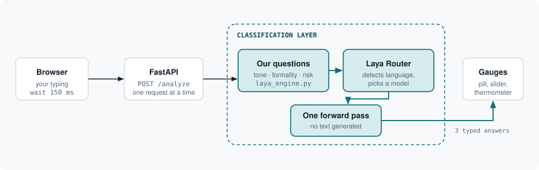
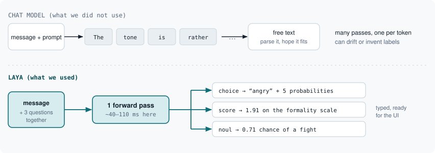
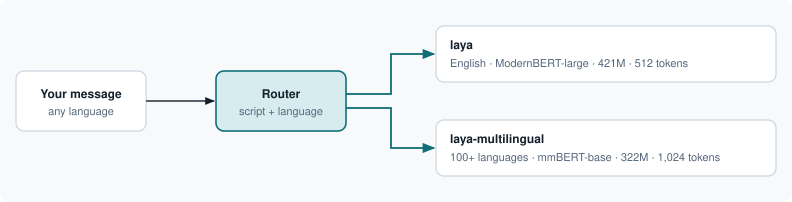
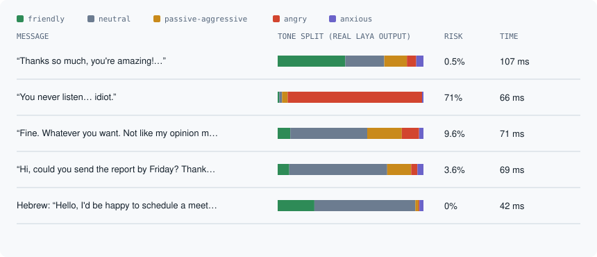

# Before You Send

**A message tone checker that runs while you type.** Paste or write a message you're nervous about (a text to an ex, an email to your boss, a Slack reply) and see how it will land, before you hit send.

You get three live readings and a language badge:

| Reading | What it shows | Comes from |
|---|---|---|
| **Tone** | friendly, neutral, passive-aggressive, angry or anxious, with a probability for each | Laya `choice` question |
| **Formality** | a 1 to 5 slider | Laya `score` question |
| **Fight risk** | a thermometer, plus a "Maybe sleep on it? 😬" banner above 60% | Laya `noul` question |

The "Copy & Send" button turns green when the risk is low.

The judging is done by [**Laya**](https://github.com/NandhaKishorM/laya), an open-source *decision model*. It is not a chat model: it never writes text, it picks from options you give it, in about 40 to 110 ms on a laptop. That speed is what makes checking on every pause in typing practical.

> **Status:** works end to end with real Laya. It is a prototype: it misses subtle passive-aggression and its formality slider barely moves (see [Findings](#findings-what-works-and-what-doesnt)).

---

## How it fits together



The browser waits 150 ms after you stop typing, then sends your text to `POST /analyze`. The FastAPI server passes it to Laya (the dashed area) and returns three typed answers, which the page turns into the pill, slider and thermometer. Everything outside the dashed box is plumbing.

---

## The classification layer: how Laya works

This is the part that makes the project different from "ask an LLM to classify it".

### It classifies. It doesn't write.



| | Regular LLM | Laya |
|---|---|---|
| How it answers | Writes tokens one by one, then you parse the text | Reads the input once and scores your options directly |
| Answers stay within your options | No, it can drift or invent labels | Yes, by construction |
| Probabilities | Made up unless extracted separately | Real model outputs, calibrated |
| Speed here | Hundreds of ms to seconds | About 40 to 110 ms |
| Cost and privacy | Per call, text leaves your machine | Free, runs locally |
| Nuance and world knowledge | Strong | Weak until fine-tuned |

Laya is a small trained network: a bidirectional encoder (ModernBERT-large, 421M parameters, for English) with a scoring head on top. All the "intelligence" is in its trained weights. There is no prompt to obey and no generation step; the code reports `output_tokens: 0`.

### What actually happens to your message

The chain in this repo is `backend/laya_engine.py` → `router.predict()` → Laya's `Agent.system_one()`.

**1. Input.** Two things go in: your message (`{"message": text}`) and our three question definitions.

**2. Each question is glued to your message as plain text.** For the tone question, the model literally sees:

```
[CLS] choice question: Classify the emotional tone of this message. [SEP]
[MASK] friendly: warm, kind, positive
[MASK] neutral: matter-of-fact, no strong emotion
[MASK] passive-aggressive: indirectly hostile, sarcastic or icy politeness
[MASK] angry: openly hostile, aggressive or insulting
[MASK] anxious: worried, apologetic, uncertain
[SEP] You never listen. This is the last time I'm asking, idiot. [SEP]
```

The formality and fight-risk questions get their own copy of your message. The three sequences run as one batch in a single model call, which is what "one forward pass" means.

**3. The encoder reads each sequence.** Every token looks at every other token, so the `[MASK]` in front of each option ends up holding a summary of how well that option fits your message.

**4. A small head scores only those `[MASK]` positions.** It produces one number per option, and a softmax with a calibration temperature turns them into probabilities.

**5. The question type decides the output:**

| Question | Laya returns | The wrapper turns it into |
|---|---|---|
| `choice` (tone) | Top label and a probability per option | Label, confidence, five bars |
| `score` (formality) | The probability-weighted average of the levels, on a 0 to 4 scale | Slider, shifted to 1 to 5 |
| `noul` (fight risk) | The probability of "true" in a false/true pair | Thermometer, 0 to 1 |

Our questions, from `backend/laya_engine.py` (shortened):

```python
"tone": {"type": "choice",
         "instructions": "Classify the emotional tone of this message.",
         "criteria": {"friendly": "warm, kind, positive", "neutral": "...",
                      "passive-aggressive": "indirectly hostile, sarcastic or icy politeness",
                      "angry": "...", "anxious": "..."}},
"formality": {"type": "score", "criteria": ["very informal slang", "...", "very formal"]},
"fight_risk": {"type": "noul", "instructions": "Is this message likely to start a fight or hurt the relationship if sent?"},
```

### The router picks the model for you



Laya's `Router` detects the script and language of each message and sends it to the English model or to the smaller multilingual one (100+ languages). The app never chooses; the Hebrew test below ran on the multilingual model in 42 ms.

---

## What it actually returned

Real output from the running app with Laya v0.3.4, five messages:



| Message | Tone | Formality | Fight risk | Time |
|---|---|---|---|---|
| "Thanks so much, you're amazing! Can't wait to see you." | friendly (46%) | 2.2 | 0.5% | 107 ms |
| "You never listen. This is the last time I'm asking, idiot." | angry (92%) | 1.9 | 71% | 66 ms |
| "Fine. Whatever you want. Not like my opinion matters anyway." | neutral (53%) | 2.1 | 9.6% | 71 ms |
| "Hi, could you send the report by Friday? Thanks." | neutral (67%) | 2.3 | 3.6% | 69 ms |
| Hebrew: "Hello, I'd be happy to schedule a meeting tomorrow…" | neutral (69%) | 2.4 | 0% | 42 ms |

## Findings: what works and what doesn't

- **Works:** blunt hostility and plain politeness are read correctly, in English and Hebrew, fast enough for live typing.
- **Misses subtle passive-aggression.** "Fine. Whatever you want…" comes back *neutral* (53%). The right answer, passive-aggressive, is second at 24%. The base model was never trained on our labels; it only reads our criteria text at run time. The Laya README warns that base checkpoints are near chance on custom workflows until fine-tuned.
- **Formality barely moves:** all five messages landed between 1.9 and 2.4.
- **Slower than advertised:** about 40 to 110 ms per message on an Apple-silicon Mac, versus the roughly 33 ms the Laya README benchmarks.
- **Startup takes 30 to 60 seconds** while the model loads. It loads once at launch so typing is never blocked.
- **If a request fails,** the page shows an error but leaves the old gauges on screen. It should grey them out (not fixed yet).

## Quick start

Requires Python 3 (built and tested on 3.12).

```bash
git clone https://github.com/roisol144/before-you-send.git
cd before-you-send
./run.sh --laya          # real Laya: first run downloads torch and the model
# or
BYS_MOCK=1 ./run.sh      # instant rule-based mock, no model needed
```

Then open <http://localhost:8000> (set `PORT=8140 ./run.sh --laya` to change the port). With `--laya`, wait about a minute after start for the model to load.

Run the tests:

```bash
cd backend && source .venv/bin/activate && python -m pytest -q      # 16 tests
```

If the model can't load, the server falls back to the mock automatically, and `/health` reports which mode is active.

## Project layout

```
backend/
  app.py            FastAPI: GET /health, POST /analyze, serves the frontend
  laya_engine.py    Laya wrapper: questions, model loading, result conversion
  mock_engine.py    rule-based fallback (tone keywords, script-based language detection)
  tests/            16 tests, including Laya mode against a stub
frontend/           index.html, styles.css, app.js (vanilla JS, no build step)
scripts/smoke_test.sh
docs/               write-up.html and the diagrams used in this README
CONTRACT.md         the API contract the parts were built against
```

## How it was built

An orchestrator agent wrote the API contract first, then ran three workers in parallel, each owning separate files: backend, frontend, and docs/QA. Afterwards the real Laya was installed, and its output was compared with the wrapper's assumptions. That caught a wrapper bug (it was inventing tone probabilities instead of using the real ones), a startup race (every keystroke tried to load the model), and a crash on Apple-silicon GPUs when requests overlapped (inference now runs one request at a time).

## Next steps

- Fine-tune Laya on a politeness or emotion dataset (its repo ships a notebook). That is the fix for both the passive-aggression misses and the flat formality slider, and it uses the same code path.
- Grey out stale gauges when a request fails.
- A browser extension that shows the meter inside Gmail and WhatsApp Web.

## Credits

- [Laya](https://github.com/NandhaKishorM/laya) by Convai Innovations, Apache 2.0.
- Background on Jev, the hosted alternative in the same "System One" category: [TypeSafe](https://typesafe.ai/blog/introducing-system-one-models-and-jev). Not used or tested here.

No license file has been added yet.
